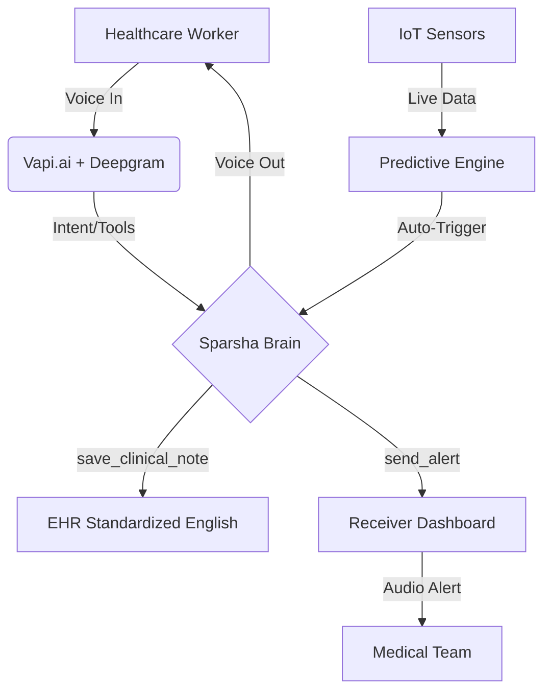

# Sparsha AI: The Future of Clinical Voice Intelligence 🏥


**Sparsha AI** is a next-generation, voice-first clinical orchestration platform designed to eliminate administrative burnout and save lives in high-pressure hospital environments. By combining state-of-the-art Voice AI, predictive IoT analytics, and stress-resilient intent recognition, Sparsha acts as a 24/7 digital co-pilot for healthcare workers.

---

## 🚀 Key Features

### 🧠 Predictive Emergency Engine (IoT Intelligence)
*   **Real-Time Vitals Analysis**: Continuously monitors IoT data streams including Heart Rate, SpO2, Blood Pressure, Respiration Rate, Temperature, and Glucose.
*   **Early Warning System**: Uses predictive logic to detect physiological deterioration *before* it becomes critical.
*   **Automatic Triggering**: Instantly alerts the voice agent and medical staff when a "Code Blue" or critical risk is predicted.

### 🎙️ "Intent Under Stress" Recognition
*   **Panic-Resilient AI**: Unlike standard voice assistants, Sparsha is trained to understand fragmented, broken, and panicked speech during emergencies.
*   **Zero-Friction Alerts**: Interprets "uhh... room 102... pulse... fast..." as a critical emergency and mobilizes the team immediately without asking for clarification.

### 🌍 Rural Healthcare Mode (Multilingual Support)
*   **Vernacular Interface**: Full conversational support for languages including **Hindi, Kannada, Tamil, Telugu, and Marathi**.
*   **Cross-Language EHR**: Nurses can dictate in their native tongue while Sparsha automatically translates and standardizes clinical notes into professional English medical terminology for the hospital's EHR.

### 📺 Mission Control UI & Cinematic UX
*   **Premium Medical Dashboard**: Completely overhauled UI with **glassmorphism**, **Outfit** typography, and a "Mission Control" command center aesthetic.
*   **Modern IoT Grid Background**: A high-tech, textured background featuring a 40px cyber-grid and a soft AI-core radial glow for immersive depth.
*   **Clinical Scanline Effect**: Subtle CRT-style scanlines that simulate the look and feel of a high-end hospital vital monitor.
*   **Netflix-Style Subtitles**: High-visibility, real-time closed captions designed for loud hospital wards.
*   **Visual Feedback**: Color-coded transcripts (User vs. Sparsha) with frosted-glass aesthetics for premium accessibility.

### 🚨 Emergency Receiver Dashboard
*   **Centralized Mobilization**: A dedicated dashboard for hospital stations that triggers **loud, continuous alarms** during emergencies.
*   **Rich Context**: Displays Patient ID, Room Number, Risk Assessment, and live vitals to the responding team instantly.

### 📄 Clinical Report Generator
*   **One-Click PDF**: Instantly generates professionally formatted Clinical Summary Reports.
*   **Full Audit Trail**: Includes admission data, historical vitals trends (last 24h), and AI-generated predictive assessments.

---

## 🛠️ Tech Stack

*   **Orchestration**: [Vapi.ai](https://vapi.ai)
*   **Speech-to-Text**: Deepgram `nova-2` (Multilingual)
*   **LLM**: OpenAI GPT-4o-mini (Reasoning & Medical Logic)
*   **Frontend**: React, Vite, Framer Motion (Animations)
*   **Backend**: Node.js (Express) & Python (FastAPI / Ollama fallback)
*   **Communication**: Server-Sent Events (SSE) for real-time dashboard sync.

---

## 🏗️ Architecture



---

## 🚦 Getting Started

### Prerequisites
*   Node.js (v18+)
*   Vite
*   Vapi Public Key

### Installation

1.  **Clone the Repository**
    ```bash
    git clone https://github.com/abhishekck31/SparshaAI.git
    cd SparshaAI
    ```

2.  **Backend Setup**
    ```bash
    npm install
    node server.js
    ```

3.  **Frontend Setup**
    ```bash
    cd frontend
    npm install
    # Update .env with your VITE_VAPI_PUBLIC_KEY
    npm run dev
    ```

---

## 🛡️ Clinical Safety & Ethics
*   **Deterministic Logic**: Medical math (dosage calculations) is handled by strict Python/JS scripts, not LLM guesses.
*   **Human-in-the-Loop**: Sparsha suggests actions but requires physician verification for critical interventions.
*   **Privacy**: Designed to be HIPAA-compliant by ensuring minimal PII retention in voice transcripts.

---

## 🏆 Hackathon Demonstration Script
1.  **The "Code Blue" Prediction**: Watch the Predictive Engine on the left. The moment it detects a drop in SpO2, Sparsha will interrupt to announce the emergency.
2.  **The Multilingual Dictation**: Speak in Kannada/Hindi. Show the Action Log Book saving the note in perfect English medical terminology.
3.  **The Stress Test**: Panic! Speak in broken sentences. Watch the Emergency Receiver dashboard light up with a loud alarm and rich data.

---

Generated with ❤️ by the Sparsha AI Team.
